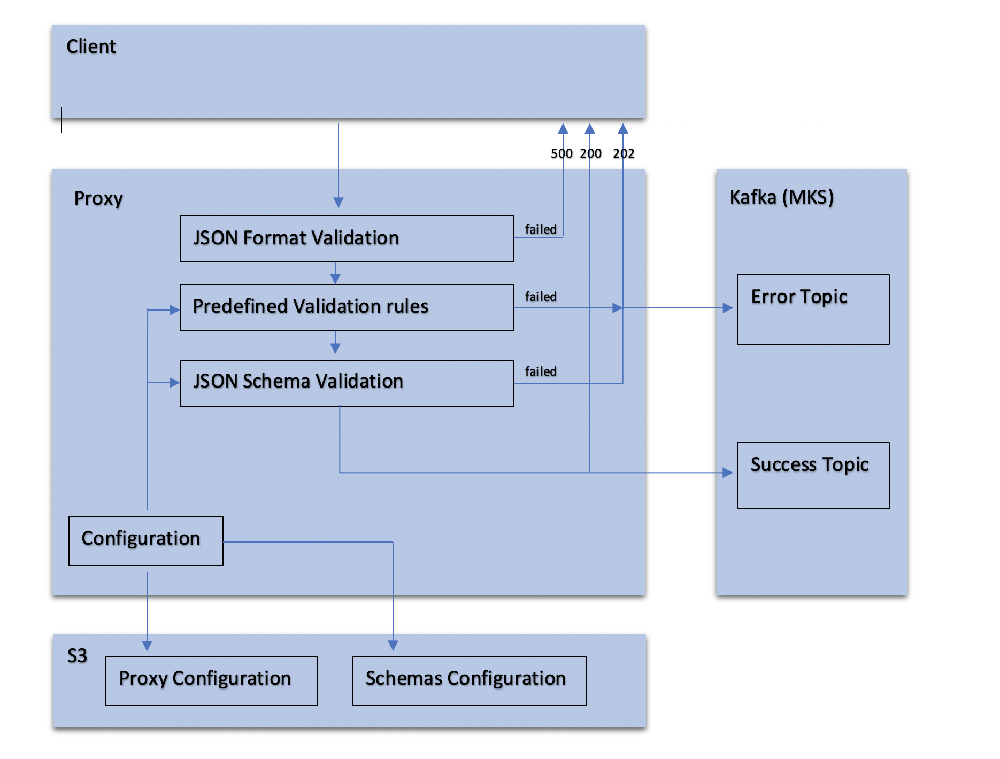

# kafka-producer-proxy
JSON schema validation proxy for Kafka producer.


# The service overview

The Kafka Producer Proxy is the lightweight scalable http based tool for High-Performance JSON validation processing
The service exposes  RESTful APIs in the Swagger Specification.
The JSON data validation is based on the predefined list of JSON schema specifications and supports 
JSON schema up to [JSON Schema draft-07](http://json-schema.org/draft/2019-09/json-schema-validation.html)

### Performance measurements
 The at the moment the Proxy is has been tested on:
  AWS EKS of 3-nodes (m5.xlarge). Under the stress test the Proxy showed capability to process up to 25K events per second.

# The processing flow and validation overview

The Kafka Producer Proxy input data should be provided as a list of message aggregate in single batch
each message might have a different JSON schema and will be processed separately according to predefined 
JSON schema associated with the given event name. 
To determine if a message is fully validated it has to pass through the following steps

1. For JSON schema validation, specific for each event
   The service utilizes [Another JSON Schema Validator](https://github.com/ajv-validator/ajv) json schema validation lib.  
2. The json schema validation could be extended with custom validate rule based on [Another JSON Schema Validator](https://github.com/ajv-validator/ajv) 
   addKeyword capability. See more in [Ajv Custom Keyword](https://github.com/ajv-validator/ajv)
   

The diagram below illustrates the entire flow.



##### The list of all available response codes

1. HTTP code 200 -  All messages were validated successully and are sent to Producer 
2. HTTP code 202 -  Indicates that the request was ok, but there's no guarantee everything actually went as it should.
3. HTTP code 401 -  Provided API key is unauthorized 
4. HTTP code 400 -  Bad request format 
5. HTTP code 500 -  Fatal error happens during the batch processing and the batch should be sent again

##### HTTP code 202  Response JSON schema

```json
{
  "type": "array",
  "title": "The Root Schema",
  "items": {
    "$id": "#/items",
    "type": "object",
    "title": "Defines an error for specific event",
    "required": [
      "eventId",
      "shouldRetry",
      "error"
    ],
    "properties": {
      "eventId": {
        "type": "string",
        "title": "The eventId Schema",
        "default": "",
        "examples": [
          "4aa8bb42-1b5a-11ea-a826-e5b72de0e096"
        ],
        "pattern": "^(.*)$"
      },
      "shouldRetry": {
        "$id": "#/items/properties/shouldRetry",
        "type": "boolean",
        "title": "Indicates whether an event sending to producer failed",
        "default": false,
        "examples": [
          false
        ]
      },
      "error": {
        "$id": "#/items/properties/error",
        "type": "array",
        "title": "The error descriptions list",
        "items": {
          "$id": "#/items/properties/error/items",
          "type": "object",
          "title": "Specific error description"
        }
      }
    }
  }
}
``` 

##### Sample

```json
   [
      {
        "eventId": "4aa8bb42-1b5a-11ea-a826-e5b72de0e096",
        "shouldRetry": false,
        "error": [
          {
            "keyword": "required",
            "dataPath": ".events[0].attributes",
            "schemaPath": "#/properties/events/items/anyOf/0/allOf/1/properties/attributes/required",
            "params": {
              "missingProperty": "attributes"
            },
            "notification": "should have required property 'attributes'"
          }
        ]
      },
      {
        "eventId": "4aa8dbb42-1b5a-11ea-a826-e5b72de0e6d",
        "shouldRetry": true,
        "error": [
    
        ]
      }
    ]
```


# The service build

## Build the server locally use the following npm and the  NodeJS versions

```angular2html
nmp : 6.4.1

node :  >  v8.16.2
```
Execute standard npm build command from the project root directory

```shell script
 npm intall
```

# The service configuration

## Configuration Airlytics Event Proxy

#### System environment
| Environment Name  | Description |
| ------------- | ------------- |
| REMOTE_CONFIG_REFRESH_PERIOD | Period in millis to sync general proxy  with the remote configuration |
| CLUSTER  | Indicates if the server will be running in node cluster mode (default **false**) |
| PORT  |  Port the Proxy listens on  |
| SSL  | Indicates if the Proxy is running with SSL  |
| VERSION  | The Proxy version |
| METRICS_PORT  | Port the Proxy exposes the Prometheus metrics  |
| DEBUG  | Whether the Proxy runs in the debug mode |
| SWAGGER  | Whether the Swagger API is enabled |
| LOCAL_HOST  | Should be set to the local machine IP, or 0.0.0.0 for Docker|
| EVENT_SCHEMA_BUCKET  | The bucket name on S3 the configuration is loaded from |
| ENVIRONMENT  | The environment proxy (PROD,DEV)  |
| KAFKA_MOCK  | Run the node server with the mocked Kafka producers (default **false**) |


### Main Proxy configuration

#### Remote configuration

The configuration Event Proxy retrieves dynamically from the static storage (AWS S3)  
The dynamic configuration is provided as a **REMOTE_CONFIGURATION_URL** env.
The Event Proxy periodically sync the current and remote configurations using **REMOTE_CONFIG_REFRESH_PERIOD** env

The Proxy supports multiple Kafka _Producer_s where each _Producer_ has it's own configuration including 
1. The list of json schemas.
2. addition configuration specific for each _Producer_ type.

The configuration has the following structure


```
S3 Root bucket  
│
└───producers
│   │   <producer-folder1>
|   |      └───event-schemas 
|   |      |     |  schema1.json
|   |      |     |  schema2.json
│   │      |  ErrorTypeExtractor.js    
│   │       
│   └───<producer-folder2>
|          └───event-schemas 
|
└─── event-proxy-config.json
```

#### Local configuration

The Proxy local configuration is localed in following files

| File location  | Description |
| ------------- | ------------- |
| /config/event-proxy-config.json | Event Proxy main configuration  |
| /schemas  | the folder of all available JSON schemas  |


The following section describes the main Proxy configuration format.
The array of elements, each element holds _Producer_ connectivity details and API-KEY
which is used for client request authentication  

Configuration sample:

```json
  [
    {
    "id": "uXI4AZc7eDZqd9t0....oXTBytOquDMeYecf",
    "name": "Prod iOS Kafka for Cloning consumer",
    "slack_web_hook": "https://hooks.slack.com/services/T04HC90Q7/BST3B3EES/...",
    "type": "kafka",
    "environment": "prod",
    "fullErrorDescription": true,
    "schemaValidatorsFolder": "products/mobile",
    "platform": "iOS",
    "ssl" : true,
    "producers": [
      "b-2.<MSK_BROKER_ID>.kafka.<REGION>.amazonaws.com:9094",
      "b-1.<MSK_BROKER_ID>.kafka.<REGION>.amazonaws.com:9094"
    ],
    "successTopics": "TestCloning",
    "errorTopic": "TestCloningError",
    "partitions": 100
   },
   {},
   {}
 ]
```

# The service deployment and running

### As a stand along instance

To start the local server instance with mocked kafka configuration 
```
  ./start_local.sh
```
The Swagger UI is accessible via http://localhost:8081/eventproxy/

### As a docker container

The main service is **/eventProxy/track**

The Docker file base image is located in the private AWS image repository

```shell script
<ACCOUND_ID>.dkr.ecr.<REGION>.amazonaws.com/amazoncorretto-nodejs:14
```

to start the Proxy as docker container use the following script

```shell script
  ./start_docker.sh
```

If you don't have the access to the **<ACCOUND_ID>.dkr.ecr.<REGION>.amazonaws.com/amazoncorretto-nodejs:<TAG>**,
any NodeJS (version **v10.11.0**) base image may be used instead
 


##  Compressed Data Support
The service supports **Content-Encoding: gzip** requests. 

Here is the sample of url request where the @sampleBatch.json.gz is the compressed JSON file

```json
curl --request POST \
  --url http://127.0.0.1:8081/eventproxy/track \
  --header 'Accept: */*' \
  --header 'Accept-Encoding: gzip, deflate' \
  --header 'Connection: keep-alive' \
  --header 'Content-Encoding: gzip' \
  --header 'Content-Length: 479' \
  --header 'Content-Type: application/json' \
  --header 'x-api-key: Z2lsLmZ1Y2hzQGdtYWlsLmNvbTpmaGdqdGp5anl0' \
  --data-binary @sampleBatch.json.gz
```